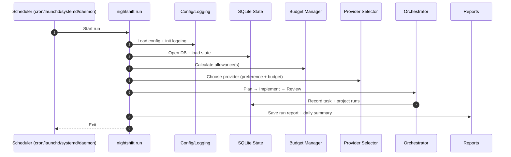

# Nightshift Run Lifecycle

This guide explains what happens from a scheduled trigger to a finished run, including logging and reports.

## High-Level Flow

1. **Scheduler triggers a run**
   - cron/launchd/systemd executes `nightshift run`
   - or the daemon scheduler calls `runScheduledTasks`
2. **Nightshift loads config + initializes logging**
3. **Budget + provider selection**
4. **Task selection**
5. **Plan → Implement → Review loop**
6. **Run record + summary + report saved**

## Where Output Goes

- **Structured logs**: `~/.local/share/nightshift/logs/nightshift-YYYY-MM-DD.log`
- **Run report**: `~/.local/share/nightshift/reports/run-YYYY-MM-DD-HHMMSS.md`
- **Daily summary** (if `reporting.morning_summary: true`):
  `~/.local/share/nightshift/summaries/summary-YYYY-MM-DD.md`
- **Status**: `nightshift status --today` for a quick recap

## Sequence Diagram

